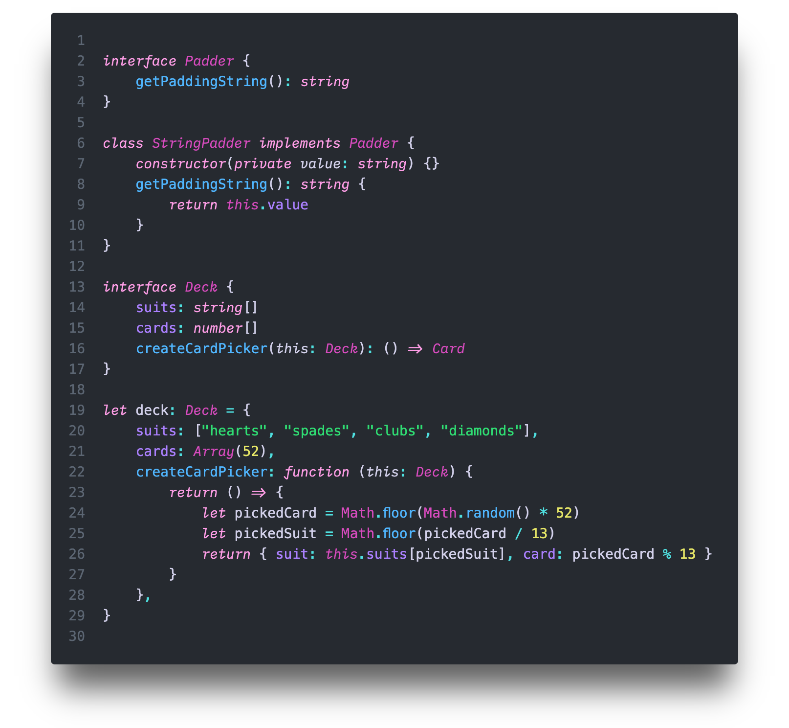

A pseudo Font Family born from a wish and a what if...

I wanted to use Menlo/Meslo Regular but I also wanted IBM Plex Mono/Lilex Italic... So what if I mixed and matched these two together?

Like so many other things, it started with an itch, and thus, this Frankenstein Font was born. It's aliiiiveeee!

<small>(Nebula Oni Theme: Hourglass)</small>

## Motivation

I've tried several different fonts over the years but I kept using [Meslo](https://github.com/andreberg/Meslo-Font) as my go-to font. Ideally, I would make it a bit thinner, but just a bit.

I came across `IBM Plex Mono` - which is a bit thinner - and I also liked its x-height to base ratio, but it wasn't quite it. On the other hand, its `italic` was quite different from its `regular`, it looked quite elegant.

So I tried for a bit to use [Lilex](https://github.com/mishamyrt/Lilex) - it's based on `IBM Plex Mono` but with ligatures -, but I didn't quite like it as much as I liked `Meslo`, but I really liked when the `italic` parts appeared in the code.

I tried to search for a configuration or maybe an extension that would allow me to use both fonts together, using the `regular` style of Meslo and the `italic` style of `Lilex`, but I couldn't find anything.

But then, it clicked! What if I fuse both fonts together?

I know typography purists might be horrified by this aberration and they might point out all the reasons why this shouldn't be done, but... To be fair, like I said, the `italic` version of `IBM Plex Mono` is quite different from its `regular` version, so I thought that it could be part of a different font altogether.

So why not?

<small>(Nebula Oni Theme: Cerberus)</small>

## License

This project is licensed under the SIL Open Font License, Version 1.1. See the [LICENSE](./LICENSE) file for details.

## Credits

The version that I based on for Meslo is called `Liga Meslo LG M DZ`. It's a patched version of a patched version. It was patched to include `Powerline` glyphs, and then it was patched again to include ligatures. And unfortunately, I couldn't track down who did what for each patch.

The original `Meslo LG` is a customized version of Apple’s `Menlo` font, which on the other hand is based on the open-source font `Bitstream Vera` and and the public domain `DejaVu`. While `Lilex` is an extended font on top of `IBM Plex Mono`.

The work I've done is minimal compared to the original authors that created the fonts, so all the credits to them, I just had an itch...

- [Meslo LG](https://github.com/andreberg/Meslo-Font)
- Menlo
- Vera Sans Mono
- DejaVu Mono
- [Lilex](https://github.com/mishamyrt/Lilex)
- [IBM Plex Mono](https://github.com/IBM/plex).
