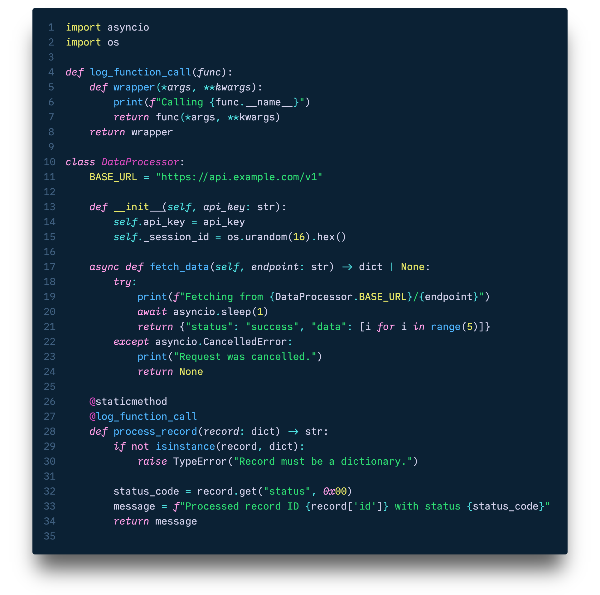

A pseudo Font Family born from a wish and a what if...

I wanted to use `Menlo/Meslo Regular` but I also wanted `IBM Plex Mono/Lilex Italic`... So what if I mixed and matched these two together?

Like so many other things, it started with an itch, and thus, this Frankenstein Font was born. It's aliiiiveeee!


<small>(Nebula Oni Theme: Hourglass)</small>

## psudoFont Liga Mono

This font has two different weights: Regular/Italic (`400`) and Bold/Bold Italic (`700`).

The styles of `Regular`, `Bold` and `Bold Italic` are based on `Liga Meslo LG M DZ` and it offers both `Powerline` glyphs and also `ligatures`. The `Italic` style is based on `Lilex` - and also support `Powerline` and ligatures.

### Installation

1. [Download](https://github.com/psudo-dev/psudofont-liga-mono/releases/download/v.1.0.0/psudoFont_Liga_Mono.zip) and Unzip the file.
2. Install the font:
   - Windows: Select all font files in the variable folder, right-click and click Install from the menu.
   - Mac: Select all font files in the variable folder and double-click them and Install.

### Visual Studio Code

1. Go to `File` > `Preferences` > `Settings`.
2. Search for `Font Family`.
3. Add `psudoFont Liga Mono` to the list of font families.
4. To enable `ligatures`, search for `Font Ligatures` and edit the `settings.json` file by adding the following line:

   ```json
   "editor.fontLigatures": true
   ```

## Motivation

I've tried several different fonts over the years but I kept using [Meslo](https://github.com/andreberg/Meslo-Font) as my go-to font. Ideally, I would make it a bit thinner - but I don't think I'll be editing hundreds of glyphs anytime soon.

I came across `IBM Plex Mono`, I liked its x-height to base ratio, but it wasn't quite it for me. On the other hand, its `italic` was quite different from its `regular` style, it looked quite elegant, it made me interested in testing it.

So I tried using [Lilex](https://github.com/mishamyrt/Lilex) for a bit - which is based on `IBM Plex Mono` but with ligatures, therefore the name, Ligature Plex, Lilex, or so I think. I didn't quite like it as much as I like `Meslo` - despite it being a bit thinner - but I really liked when the `italic` parts appeared in the code.

I tried to search for a configuration or maybe an extension that would allow me to use both fonts together, using the `regular` style of Meslo and the `italic` style of `Lilex`, but I couldn't find anything.

But then, it clicked! What if I fuse both fonts together myself?

I know typography purists might be horrified by this aberration and they might point out all the reasons why this shouldn't be done, but... To be fair, like I said, the `italic` version of `IBM Plex Mono` is quite different from its `regular` version, so I thought that it could go well with a different font.

So why not?


<small>(Nebula Oni Theme: Cerberus)</small>

## License

This project is licensed under the SIL Open Font License, Version 1.1. See the [LICENSE](./LICENSE) file for details.

## Credits

The version that I based on for Meslo is called `Liga Meslo LG M DZ`. It's a patched version of a patched version. It was patched to include `Powerline` glyphs, and then it was patched again to include ligatures. And unfortunately, I couldn't track down who did what for each patch, only the original author.


The original `Meslo LG` is a customized version of Apple’s `Menlo` font, which on the other hand is based on the open-source font `Bitstream Vera` and the public domain `DejaVu`. While `Lilex` is an extended font on top of `IBM Plex Mono`.

The work I've done is minimal compared to the original authors that created the fonts, so all the credits to them, I just had an itch and here we are...

- [Meslo LG](https://github.com/andreberg/Meslo-Font)
- Menlo
- Vera Sans Mono
- DejaVu Mono
- [Lilex](https://github.com/mishamyrt/Lilex)
- [IBM Plex Mono](https://github.com/IBM/plex).

### Author

- [@psudo-dev](https://github.com/psudo-dev/)
