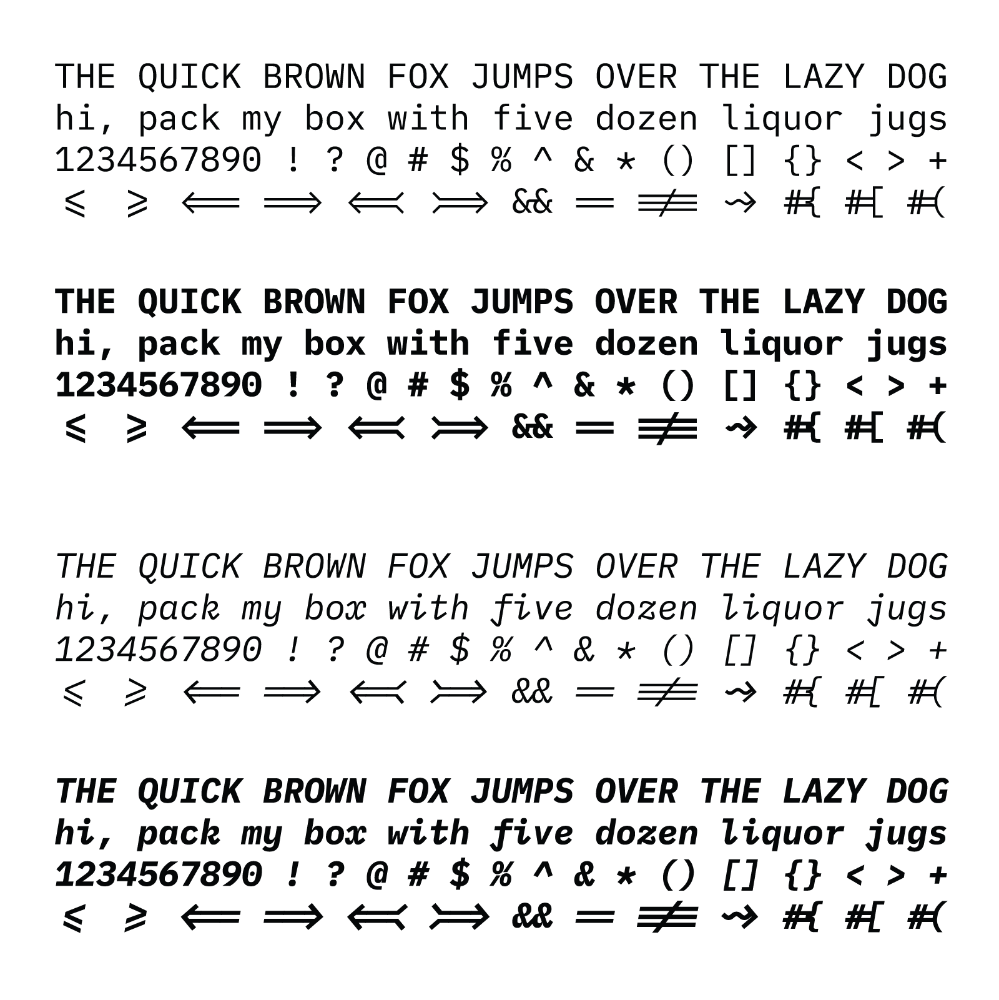
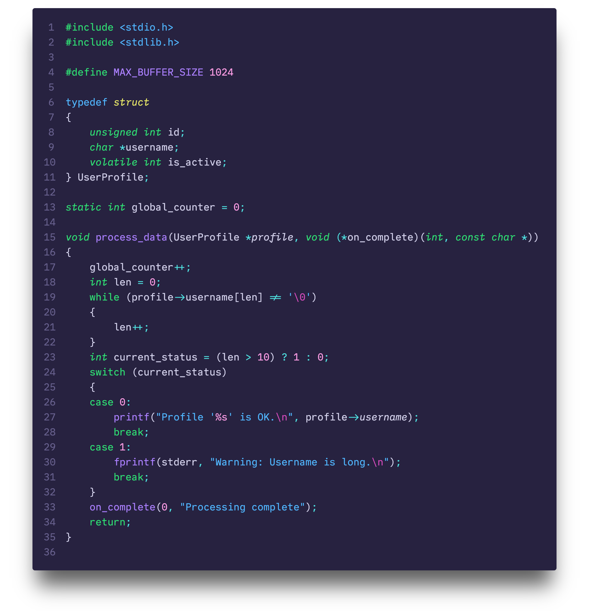

## psudoFont Liga Mono

`psudoFont Liga Mono` is a `monospaced` font family with `programming ligatures`, based on `Meslo/Menlo` and `IBM Plex Mono/Lilex`. It's designed for coding and terminal use.

This font has two different weights: Regular/Italic (`400`) and Bold/Bold Italic (`700`).

This is a new font family, a lot of glyphs were redesigned, some resemble `Menlo/Meslo`, some `IBM Plex Mono/Lilex`, and some others are unique to `psudoFont Liga Mono`. The changes and adjustments vary from small details to entire characters but always keeping the core identity within the font family.

The whole journey resembled a lot what I went through when I created my color theme [Nebula Oni Theme](https://github.com/psudo-dev/nebula-oni-theme/), the same theme used to render the examples [below](#examples) - but this project took a month instead of several months.


### Installation

0. Uninstall the previous version if you have it installed.
1. [Download](https://github.com/psudo-dev/psudofont-liga-mono/releases/download/v.2.1.0/psudoFont_Liga_Mono.zip) and Unzip the file.
2. Install the font:
    - Windows: Select all font files in the folder, right-click and click Install from the menu.
    - Mac: Select all font files in the folder and double-click them and Install.

### Visual Studio Code

1. Go to `File` > `Preferences` > `Settings`.
2. Search for `Font Family`.
3. Add `psudoFont Liga Mono` to the list of font families.
4. To enable `ligatures`, search for `Font Ligatures` and edit the `settings.json` file by adding the following line:

    ```json
    "editor.fontLigatures": true
    ```

## Major Version History

For a complete list of changes, see the release notes on [Releases](https://github.com/psudo-dev/psudofont-liga-mono/releases).

### V.2.0.0 (October, 1st, 2025)

I was naive... I thought I wouldn't actually edit and design glyphs myself because it would be too much work, but I was wrong - I underestimated my itch... It last a month or so and here we are, a completely new version!

I previously complained that I liked `Menlo/Meslo` but I wanted to make it a bit thinner and that I liked `IBM Plex Mono/Lilex`'s italic but not all of it. So I went ahead and changed all of that.

This version of `psudoFont Liga Mono` is much more cohesive and consistent and now I can say it's actually a Font Family instead of a _Frankenstein_ - fused together with multiple fonts...

### V.1.0.0 (August, 8th, 2025)

I wanted to use `Menlo/Meslo Regular` but I also wanted `IBM Plex Mono/Lilex Italic`... So what if I mixed and matched these two together?

And that's what I did.

Like so many other things, it started with an itch, and thus, this _Frankenstein Font_ was born. It's aliiiiveeee!

## Motivation

**TL;DR:** It always starts with an itch, usually when something bothers me, the itch grows through time and _sometimes_ I end up doing it myself. That's how I ended up here, somehow creating my own programming font.

---

I've tried several different fonts over the years but I kept using [Meslo](https://github.com/andreberg/Meslo-Font) as my go-to font. For the past few years I've been using a version with ligatures and powerline: `Liga Meslo LG M DZ`.

I came across `IBM Plex Mono` and I liked its x-height to base ratio, but it wasn't quite it for me, there were some characters and symbols that I didn't quite like. On the other hand, its `italic` was quite different from its `regular` style, it looked elegant, it made me interested in testing it.

I tried using [Lilex](https://github.com/mishamyrt/Lilex) for a bit - which is based on `IBM Plex Mono` but with ligatures - therefore the name, Ligature Plex, Lilex, or so I think.

I think `Meslo/Menlo`'s `regular` look a bit too thick, and although I really liked `IBM Plex Mono/Lilex`'s `italic`, I didn't like it enough to overlook what I didn't like about it, so I ended up switching back to `Meslo/Menlo`.

That, until I started thinking about making my own font design...

## Design Choices

I used `Lilex` as a base because it would be easier than starting from scratch or making all `Meslo` glyphs thinner, plus, I would have to adjust the x-height of all characters of either font.

`Lilex` has 1000UPM, so I scaled up all glyphs to 2048UPM, which seems to be the standard for most new fonts

For `regular` I kept `Meslo` as a reference but there were also some symbols, marks and even small details that I preferred from `Lilex` - like the ending's curves and angles - so I used those as well.

`Lilex`'s `italic` had a lot of sharp corners, so I redesigned them all to be more rounded and smooth. This small detail made me redesigned lots of glyphs. I also changed some characters like `w`, `v`, `r`, `{`, `}`, `@`, `5`, `6`, `9`, etc. Actually, I had to change the numbers in both `regular` and `italic`.



Another thing that I didn't like about `Liga Meslo LG M DZ` were the ligatures combinations for `fi`, `ffi`, `fl`, `ffl`, etc. They get too close together, I don't like how it looks. So I'm not supporting these ligatures.

`Meslo` had almost double the glyphs compared to `Lilex` - which already had more than 1400 glyphs -, and it wouldn't be viable for me to redesign and adjust all these extra characters, so I didn't. They don't affect the overall use, it still supports all `Lilex` ligatures and symbols and some extras I included.

Considering that when this all started I didn't know how to edit a single glyph, all the hustle in between and 3 redesigns later, I would say I liked the final result. Although inspired by `Meslo` and `Lilex`, this turned out to be its own unique font family.

## Examples

Click on the images to see a larger version with more details, the low-res image rendering is pretty bad for texts with dark backgrounds.

-   TypeScript


<small>(Nebula Oni Theme: Hourglass/Grey)</small>

-   Python


<small>(Nebula Oni Theme: Cerberus/Glacial Blue)</small>

-   C
    
    <small>(Nebula Oni Theme: Spirograph/Purple)</small>

-   Terminal
    
    <small>(Nebula Oni Theme)</small>

## License

This project is licensed under the SIL Open Font License, Version 1.1. See the [LICENSE](./LICENSE) file for details.

## Credits

-   [Meslo LG](https://github.com/andreberg/Meslo-Font)
-   Menlo
-   Vera Sans Mono
-   DejaVu Mono
-   [Lilex](https://github.com/mishamyrt/Lilex)
-   [IBM Plex Mono](https://github.com/IBM/plex).

The original `Meslo LG` is a customized version of Apple’s `Menlo` font, which on the other hand is based on the open-source font `Bitstream Vera` and the public domain `DejaVu`. `Lilex` is an extended font on top of `IBM Plex Mono`.

## Author

-   [@psudo-dev](https://github.com/psudo-dev/)
-   If you really liked it, give it a star!
-   Would you consider [buying me a coffee](https://buymeacoffee.com/psudodev) to support my work? Thank you!
